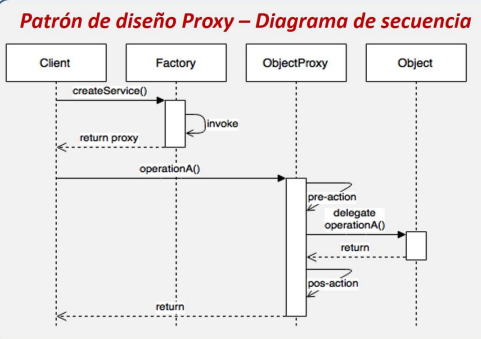
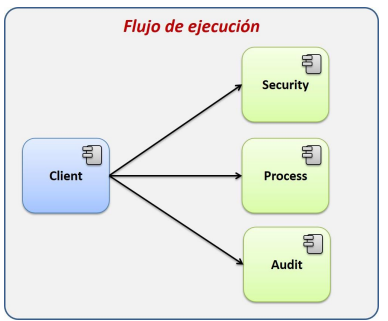
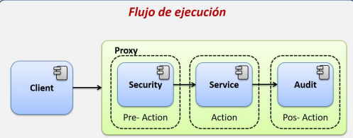
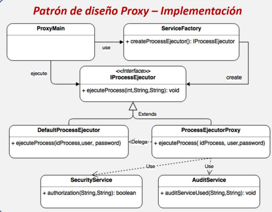

<div align="center">
<table>
    <theader>
        <tr>
            <th></th>
            <th>
                <span style="font-weight:bold;">UNIVERSIDAD LA SALLE</span><br />
                <span style="font-weight:bold;">FACULTAD DE INGENIERÍAS</span><br />
                <span style="font-weight:bold;">DEPARTAMENTO DE INGENIERÍA Y MATEMÁTICAS</span><br />
                <span style="font-weight:bold;">CARRERA PROFESIONAL DE INGENIERÍA DE SOFTWARE</span>
            </th>            
        </tr>
    </theader>
    
</table>
</div>

<div align="center">
<span style="font-weight:bold;">GUÍA DE LABORATORIO</span><br />
</div>

<table>
    <theader>
        <tr><th colspan="2">INFORMACIÓN BÁSICA</th></tr>
    </theader>
<tbody>

<tr><td>TÍTULO DE LA PRÁCTICA:</td><td>Examen final de lenguaje de programacion III:Patrón proxy</td></tr>
<tr><td colspan="2">RECURSOS:
    <ul>
        <li><a href="https://git-scm.com/book/es/v2">https://git-scm.com/book/es/v2</a></li>
        <li><a href="https://guides.github.com/">https://guides.github.com/</a></li>        
        <li><a href="https://www.w3schools.com/java/default.asp">https://www.w3schools.com/java/default.asp</a></li>
    </ul>
</td>
</<tr>
<tr><td colspan="2">DOCENTES:
    <ul>
        <li>Richart Smith Escobedo Quispe  - r.escobedo@ulasalle.edu.pe</li>
    </ul>
</td>
</<tr>
</tdbody>
</table>

# Patrón proxy

## OBJETIVOS Y TEMAS

### OBJETIVOS
- Conocer mas acerca del patrón proxy.
- Implementar el patron proxy en lenguaje java.

### TEMAS
- Editor Vim
- Java
- Git
- GitHub

## CONTENIDO DE LA GUÍA

### MARCO CONCEPTUAL

- Editor Vim
    - Vim es un editor de texto muy eficiente para programar en consola que no tiene nada que envidiar a los editores gráficos.
    
- Instalar Vim en:

	- MS Windows
        - Para descarga en sistemas MS Windows https://www.vim.org/download.php

#

- Java
    - Java es un lenguaje de programación orientado a objetos
    - La documentación de Java 11 se encuentra en: https://docs.oracle.com/javase/specs/jls/se11/html/index.html
    - Un curso muy interesante en videos se puede encontrar en: https://www.youtube.com/playlist?list=PLw8RQJQ8K1yQDqPyDRzt-h8YlBj96OwMP
    
    - Instalar Java

        - MS Windows
            - Para descarga en sistemas MS Windows https://www.oracle.com/java/technologies/downloads/

#

- Git
    - Git es un sistema de control de versiones creado por Linus Torvalds. Es eficiente, confiable. 

- Instalar Git
      
	- MS Windows
        - Para descarga en sistemas MS Windows https://git-scm.com/download/win

#
- Patron proxy 
	- Es un patron de diseño estructural que nos permite realizar ciertas acciones antes y despues de realizar la accion solicitada del usuario,se caracteriza porque el cliente solo recibe un objeto identico al esperado, por lo tanto ignora la mediacion que se esta llevando.
	- El proxy actua como una mascara para encapsular la logica y ejecutar al objeto remoto.
	- Controla el acceso al objeto original,identificando primero al cliente y ver si tiene acceso al objeto.
	- se controla el acceso al objeto debido a situaciones donde se consume una gran cantidad de recursos del sistema,por ello carga al objeto real solo cuando es requerido y no desde un inicio.
	- Componentes
		- IObject: representa la interface comun entre el object y el proxy.
		- Object: representa al objeto que el usuario quiere ejecutar.
		- Proxy: implementa IObject y delega responsabilidades al object
	- Para que el cliente utlice el proxy sera necesario implementar un mecanismo que nos permite controlar la creacion de los objetos.
	
	
		
#

## EJERCICIO RESUELTO 


# Escenario

- se desarrolla un portal para ejecutar procesos  y estos solo pueden ser ejecutados por personas autorizadas y deben ser auditadas.
- se pide realizar acciones previas a la ejecuacion y otras posteriores que se definiran despues, por lo que se debe prepara el sistema preparado para agregar estas nuevas acciones.
- se realiza los siguientes servicios:
	- securityService: servicio que valida si el usuario tiene privilegios para ejecutar el proceso.
	- AuditService: Servicio para registrar cuando un usuario ejecuta un proceso.
		

		
- Luego se desarrolla una solucion, se debe crear una nueva clase que encapsule los procesos, tambien se obligara al cliete a instanciar el proceso a traves de Factory,el cual nos asegura que el cliente reciba un proxy en vez de un objeto de ejecucion de procesos, asi mismo nos asegura de que si el proxy agrega nuevas funcionalidades pre y post, el cliente no se entera y no afecta a los componentes desarrollados con anterioridad.
		


		
# Implementacion

- Se crea un nuevo proyecto en GitHub
- Crear un repositorio local usando git init
-Se crea una implentacion de patrón proxy
		


-Se crea una implentacion de patrón proxy
-Se comienza con la creacion de un paquete "EjecucionProcesosProxy".
-dentro del paquete se crea otro paquete "services".

- Clase AuditService

	- Recibe el usuario y proceso que se ejecuto e imprime el registro de ejecucion.
	-se crea una nueva clase new>java class llamado "AuditService" se agrega el codigo.

```java

  public void auditServiceUsed(String usuario, String servicio){
  
         SimpleDateFormat formatear= new SimpleDateFormat("dd/MM/YYYY hh:mm:ss");
         
         System.out.println(usuario + " utilizo el servicio > " + servicio + ", a las " +formatear.format(new Date())); 
     }
  ```

- Clase SecurityService
	- Simula un servicio de seguridad y proporciona un metodo de autorizacion donde la valizadacion es con el usuario y la contraseña.
	- Se crea una nueva clase new>java class llamado "SecurityService"se agrega el codigo.

 ```java
 
      public boolean authorization(String usuario,String contraseña){

         if(usuario.equals("susana") && contraseña.equals("1234")){
         
             System.out.println("Usuario " + usuario + " autorizado");
             return true;
         }
         else{
         
             System.out.println("Usuario " + usuario + " No autorizado");
             return false;
             
         }
     }
 ```
- Interface IProcessEjecutor
	- Interfaz que define la estrucutra de los ejecutores de procesos asi como de los proxys.
	- Se crea una nueva interfaz new>java interface llamado "IProcessEjecutor"
	- Se agrega el codigo.

 ```java
  public void ejecuteProcess(int idProceso, String usuario, String contraseña)
  
        throws Exception; 
```
        
- Clase DefaultProcessEjecutor
	- Se crontola la creacion atraves de factory , la clase herada de IProcesssEejcutor e implementa el metodo ejecuteProcesss el cual simula realizar una tarea.
	- Se crea una nueva interfaz new>java class llamado "DefaultProcessEjecutor".
	- Se agrega el codigo.

 ```java
public class DefaultProcessEjecutor implements IProcessEjecutor{


    @Override
    
    public void ejecuteProcess(int idProceso, String usuario, String contraseña) throws Exception {
    
        System.out.println("Proceso " + idProceso + " en ejecucion");
        System.out.println("Proceso " + idProceso + " terminado.");
    }
   
}
```
- Clase ProcesssEjecutorProxy
- Se tiene a preaction para realizar la validacion de los privilegios del usuario,action donde se realiza la ejecuacion del proceso y pos action se realiza la auditoria.
- Se crea una nueva interfaz new>java class llamado "ProcessEjecutorProxy"
- Se agrega el codigo.


 ```java
public class ProcessEjecutorProxy implements IProcessEjecutor{

    @Override
    public void ejecuteProcess(int idProceso, String usuario, String contraseña) throws Exception {
    
        
        SecurityService securityService = new SecurityService();
        if(!securityService.authorization(usuario, contraseña)){
         throw new Exception("El usuario '"+usuario +"' no tiene privilegios para ejecutar el proceso");//capture y crear excepcion y se personalice la excepcion y muestra mensaje
            
        }
        
        
        DefaultProcessEjecutor ejecutorProcesos = new DefaultProcessEjecutor();
        ejecutorProcesos.ejecuteProcess(idProceso, usuario, contraseña); 
        AuditService audit = new AuditService();
        audit.auditServiceUsed(usuario, DefaultProcessEjecutor.class.getName());
        
       
    }
   
}
```

- Clase ServiceFactory
	- Clase utilizada como factory, la cual regresa un instancia de la clase ProcessEjecutorProxy la cual es un proxy.

	- Se crea una nueva interfaz new>java class llamado "ServiceFactory"
	- Se agrega el codigo.

 ```java
 public static IProcessEjecutor createProcessEjecutor(){
        return new ProcessEjecutorProxy();
        
    }
  ```

 Clase Proxy main
	- Clase principal para probar la aplicacion.
	- Se crea una nueva interfaz new>java main class llamado "MainProxy"
	- Se agrega el codigo.

 ```java
       String usuario = "susana";
 
        String contraseña = "1256";
        
        int proceso = 1;
        
        IProcessEjecutor processEjecutor = ServiceFactory.createProcessEjecutor();
        
        try {
        
            processEjecutor.ejecuteProcess(proceso, usuario, contraseña);
        } 
        catch (Exception ex) {
            System.out.println(ex.getMessage());
        }
```

- Luego se crear un archivo Readme.md con contenido Markup
 ## USO 
 
 # Spring framework
 
 - Spring tiene la capacidad de crear dos tipos de objetos proxies en dependencia del origen de los mismos, en el proceso de arranque iniciará todos los objetos de las clases marcadas para instanciar (@Component, @Service, @Repsitory, etc) y pondrá estos objetos a disposición de la aplicación para ser usados, inyectándolos de acuerdo a lo programado. Por defecto los objetos creados se crean como Singleton.
- En el proceso de crear los objetos, Spring definirá que tipo de proxy usar de los 2 disponibles.
	- JDK Dynamic Proxy: Es el proxy por defecto, se empleará si el objeto objetivo a instanciar implementa una interfaz.
	- CGLib Proxy: Este es el proxy que será usado cuando el objeto a crear no implementa ninguna interfaz.


#

## REFERENCIAS
- https://www.academia.edu/39945137/Introduccion_a_los_patrones_de_dise%C3%B1o
- https://www.youtube.com/watch?v=ORXfXNsrqH0
- https://sacavix.com/2020/12/17/patron-proxy-como-lo-hace-spring-framework/
- https://es.wikipedia.org/wiki/Proxy_(patr%C3%B3n_de_dise%C3%B1o)


#

